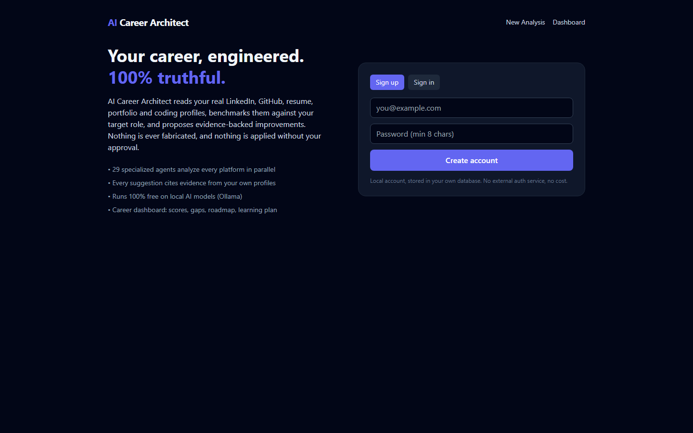
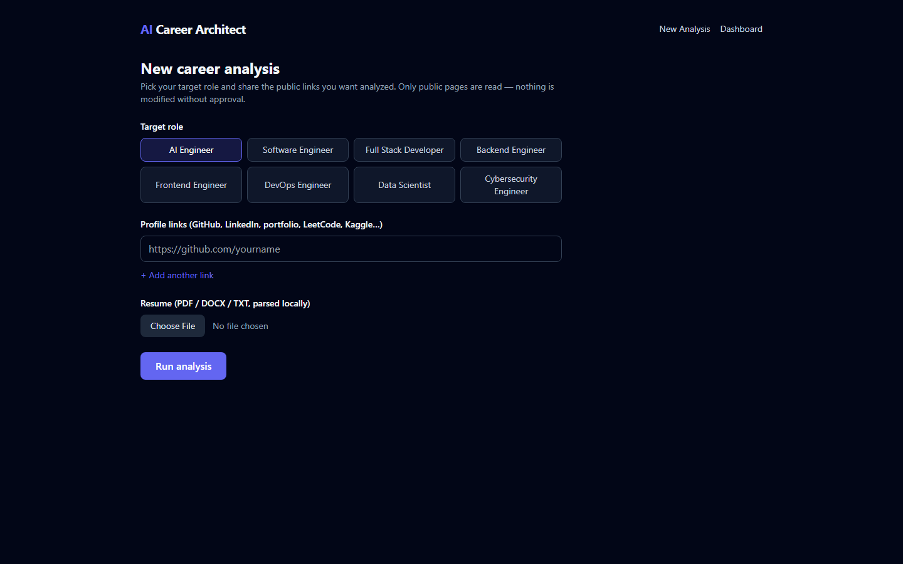
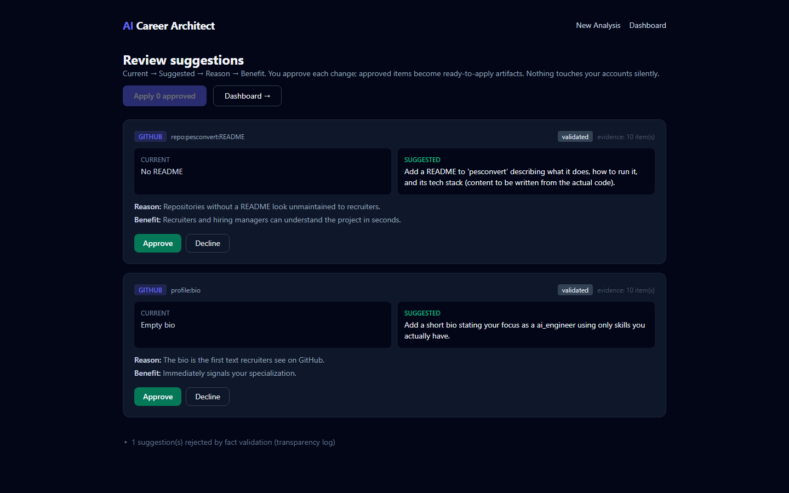
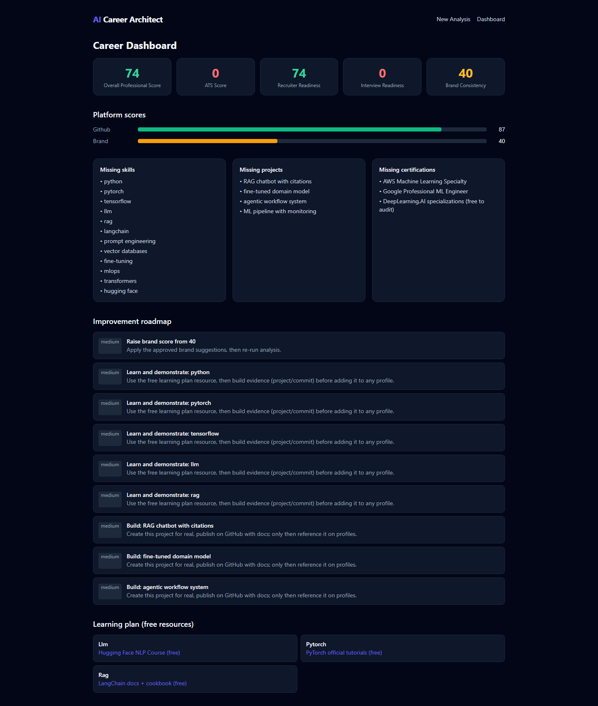

# AI Career Architect

An AI-powered **Career Operating System** that turns your real professional
digital presence — LinkedIn, GitHub, resume, portfolio, coding profiles —
into a recruiter-ready, role-specific ecosystem while staying **100% truthful**.

Nothing is ever fabricated. Every suggestion cites evidence collected from
your own profiles, passes a fact-validation gate, and requires your explicit
approval before anything is applied.

<p align="center">
  
  
</p>
<p align="center">
  
  
</p>

**Runs at zero cost:** local Ollama models, free GitHub API, local SQLite,
optional free Docker services. No paid API is ever required.

## How it works

```
Sign in → pick target role → paste profile links + upload resume
   → collectors read public pages (GitHub API, Playwright, local parsers)
   → Unified Professional Profile + evidence chain
   → 29 agents run in phased parallel waves:
       research → analysis → gap detection → improvement drafting
   → Fact Validation gate (six questions; ungrounded claims rejected)
   → you review Before/After cards and approve/decline each suggestion
   → approved items become apply-ready artifacts + verification
   → Career Dashboard: scores, gaps, roadmap, free learning plan
```

### Truth guarantee

Every suggestion must pass:
1. Is it true? 2. Is it verifiable? 3. Does evidence exist?
4. Does it improve professionalism? 5. Does it match the selected role?
6. Has the user approved it?

The deterministic grounding check rejects any metric or named entity not
present in collected evidence — even when no LLM is running. Rejected
suggestions stay visible in a transparency log with the rejection reason.

### Supported platforms

GitHub (free REST API), resume (PDF/DOCX/TXT parsed locally), LinkedIn,
portfolio sites, LeetCode, HackerRank, Codeforces, Kaggle, Stack Overflow,
Devpost, Medium, Behance, Dribbble (public pages via Playwright with an
HTTP fallback). New platforms plug in via `app/collectors/registry.py`.

### Applying changes

The system never silently modifies your accounts. Approved suggestions are
generated as **apply-ready artifacts** (README drafts, bio text, resume
wording, SEO snippets) under `apps/api/data/output/run_<id>/` with a
Current → Suggested → Reason → Benefit → Approve → Apply → Verify flow.
Re-running an analysis verifies the changes landed.

## Quick start (zero cost)

Prereqs: Python 3.12+, Node 18+, [Ollama](https://ollama.com) (free).

```powershell
# 1. Backend
python -m venv .venv
.venv\Scripts\python -m pip install -r apps\api\requirements.txt

# 2. Local model (any Ollama model works; qwen3:8b recommended)
ollama pull qwen3:8b

# 3. Config
copy .env.example .env    # defaults are already zero-cost

# 4. Frontend
cd apps\web; npm install; cd ..\..

# 5. Run both servers
.\scripts\dev.ps1
```

Open http://localhost:3000. API docs: http://localhost:8000/docs.

**No Ollama? Still works.** Every agent has a deterministic fallback, so
analysis, validation, scoring and the dashboard function with zero LLM.

**Optional extras (all free):**
- `docker compose up -d` — Postgres+pgvector, Redis, Ollama in containers
  (then set `DATABASE_URL`/`REDIS_URL` in `.env`)
- `.venv\Scripts\python -m playwright install chromium` — richer scraping +
  screenshots (HTTP fallback used otherwise)
- `GITHUB_TOKEN` in `.env` — raises GitHub API rate limit (still free)
- Paid keys (OpenAI/Anthropic/Gemini) are supported via LiteLLM but never required.

## Architecture

```
apps/api  FastAPI backend
  app/core        config, structlog logging, async SQLAlchemy, cache
                  (Redis→memory fallback), LiteLLM client (retry + salvage)
  app/collectors  github (REST), resume (pypdf/docx), web (Playwright→httpx)
  app/agents      29 agents in phased parallel pipeline (orchestrator.py);
                  every agent has a zero-LLM deterministic fallback
  app/services    validation (grounding + LLM cross-exam), scoring rubrics,
                  approval/apply/verify, run pipeline + SSE events
  app/routers     auth (JWT), runs (+SSE), suggestions, dashboard
  tests           20 tests: validation gate, scoring, collectors,
                  end-to-end pipeline, API
apps/web  Next.js 14 + Tailwind: auth, setup, live progress, review, dashboard
```

### Agents

Career Orchestrator; Profile Collector, Screenshot, Content Extraction;
Role/Market Research, Professional Benchmark; LinkedIn/GitHub/Resume/
Portfolio/Coding Profile/Brand Analysis; Skill/Experience/Project/
Certification Gap; LinkedIn/GitHub/Resume/Portfolio Improvement,
Documentation Generator, ATS Optimizer, Recruiter Simulation;
Fact Validation; Approval Manager, Platform Update, Verification;
Career Report Generator.

## Testing

```powershell
cd apps\api
..\..\.venv\Scripts\python -m pytest -q   # 20 tests
cd ..\web
npm run build                              # type-check + production build
```

## Extending

- New platform: subclass `BaseCollector`, call `register_platform()`.
- New agent: subclass `BaseAgent`, add to a phase in `agents/orchestrator.py`.
- New role: add an entry to `ROLE_TAXONOMY` in `agents/research.py`.
